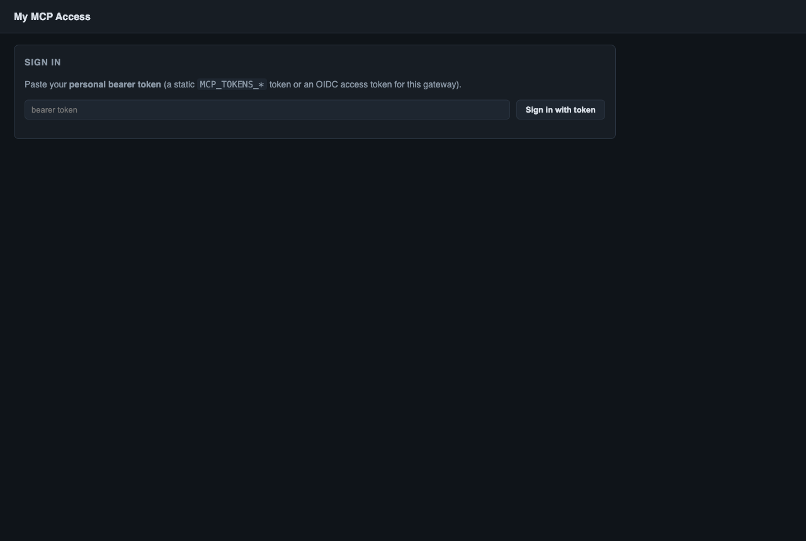
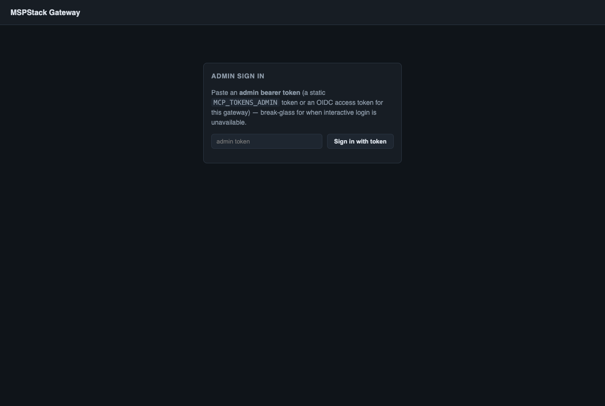
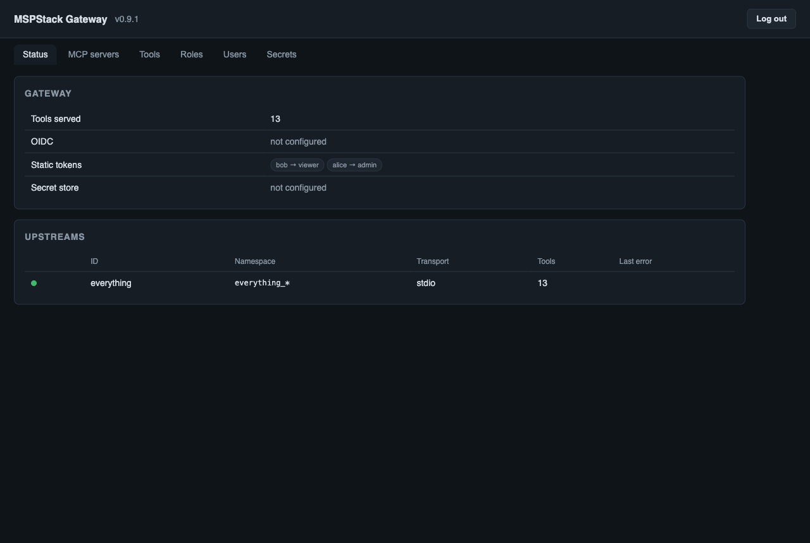
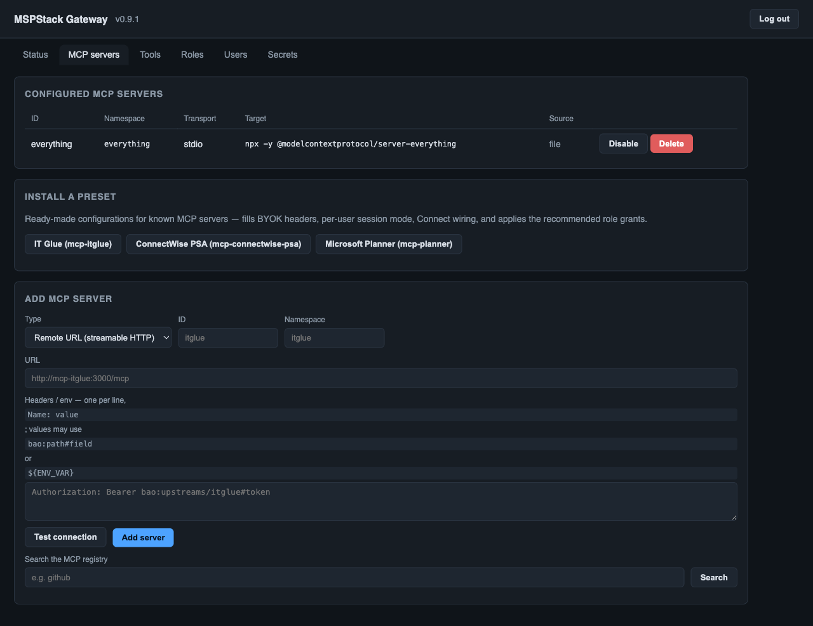
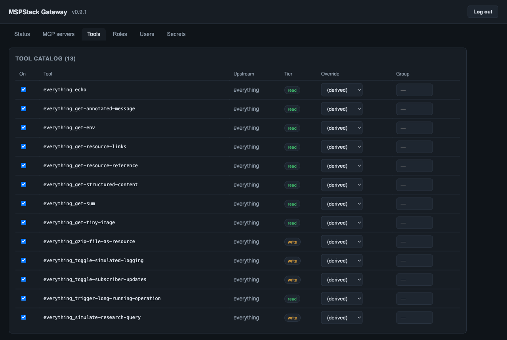
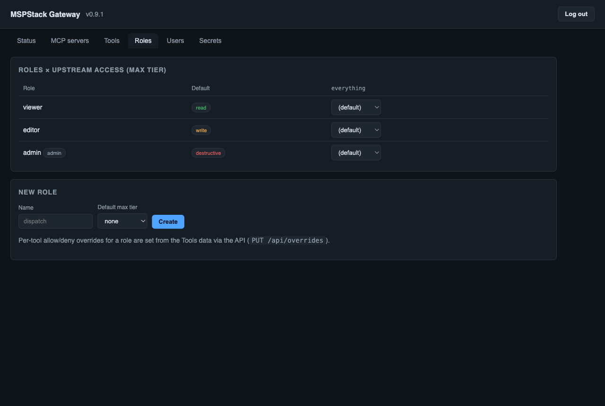
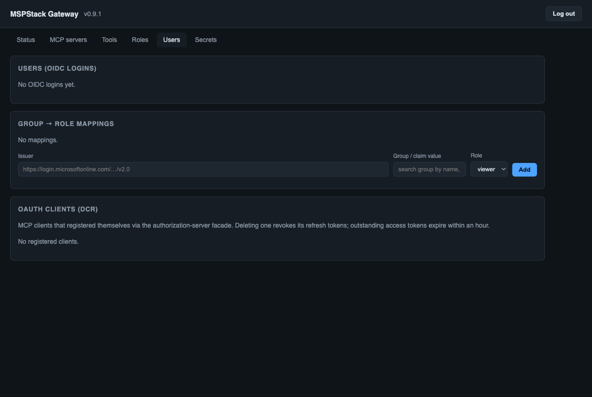
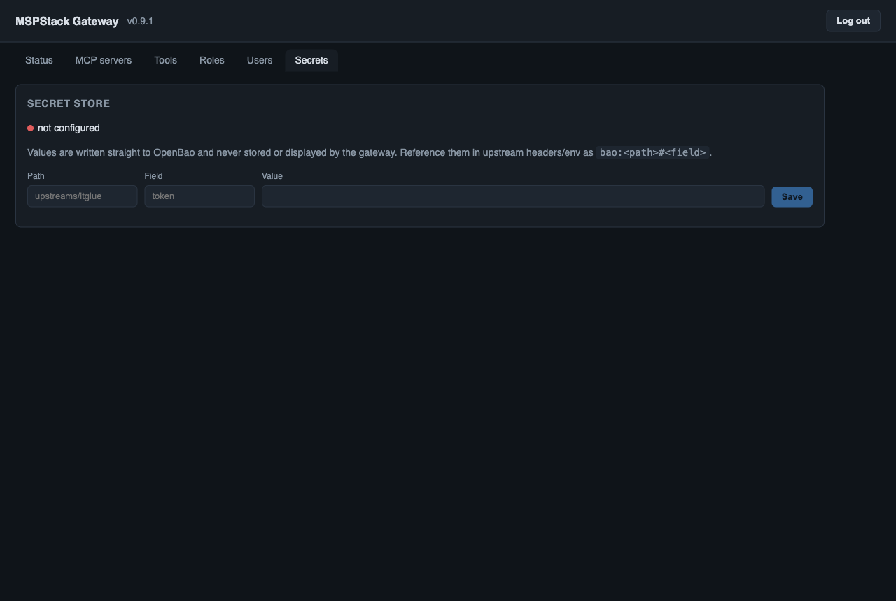
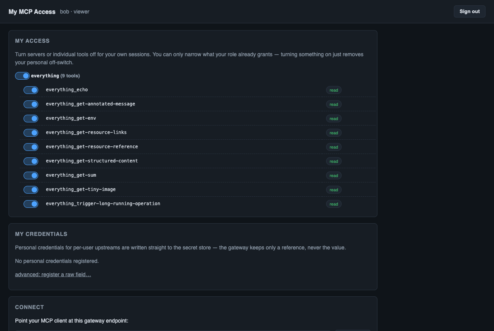
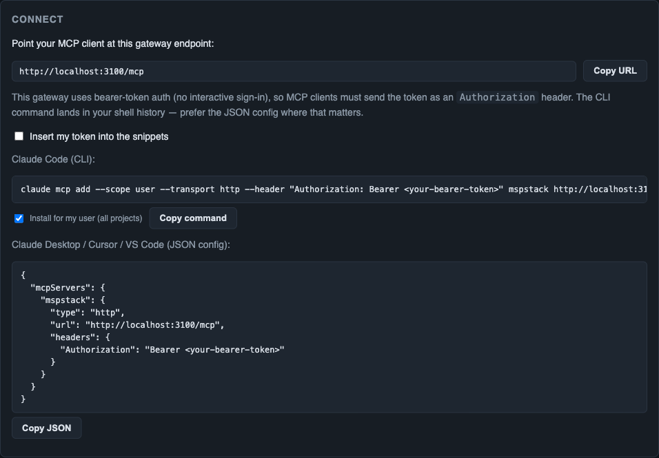

# UI guide: `/admin` and `/me`

The gateway ships two browser pages, both dependency-free single-file HTML served
by the gateway itself:

- **`/admin`** — the operator console: upstreams, tool catalog, roles, users,
  secrets. Requires the **admin** role.
- **`/me`** — the self-service page for every signed-in principal: what *I* can
  use, my personal credentials, how to connect my MCP client.

Both pages render their own sign-in and talk to the JSON API underneath
(`/api/*` admin-only, `/api/me/*` any principal). The pages are convenience —
**the API is the security boundary**, enforced server-side on every request.

## Signing in

Both pages accept two credentials:

| Method | When available | Notes |
| --- | --- | --- |
| **Sign in with Microsoft** | interactive login configured (`AUTH_CLIENT_ID`/`AUTH_CLIENT_SECRET`/`SESSION_SECRET` + an OIDC issuer) | cookie session, identity only — the role is re-resolved on every request |
| **Bearer-token paste** | always | a static `MCP_TOKENS_*` token or an OIDC access token for this gateway; kept in `sessionStorage` (dies with the tab), sent as an `Authorization` header |

On a token-only deployment the `/me` panel shows just the token box (the page
asks `GET /health`, which reports `login: false`). With OAuth configured,
session-less visits to `/` and `/me` skip the panel entirely and redirect
straight to the IdP — append **`?signin=token`** to reach the token box anyway
(break-glass for when the IdP is down).

For static tokens, **the token's label is the identity**: `MCP_TOKENS_ADMIN="alice:…"`
signs in as `alice`. Labels must be unique across all `MCP_TOKENS_*` variables —
the gateway refuses to start otherwise, because `/me` prefs and personal
credentials are keyed by them.

---

## `/admin` — operator console

As on `/me`, the Microsoft button appears only when interactive login is
configured (the page checks `/health`); on a token-only deployment you get just
the token box, shown above.

### Status

The landing tab — a health snapshot:

- **Gateway**: tools served, OIDC issuer (or *not configured*), static token
  labels with their roles, secret store connectivity.
- **Upstreams**: one row per configured server — live status dot, namespace
  prefix, transport, tool count, and the last connection error if any.

### MCP servers

Everything about upstreams:

- **Configured MCP servers** — the current list with source (`file` =
  `mspstack.config.json`, `api` = added at runtime), Disable/Delete. Changes are
  hot: connected MCP clients get a `tools/list_changed` notification.
- **Install a preset** — one-click configs for the MSPStack family servers
  (IT Glue, ConnectWise PSA, Microsoft Planner). A preset fills in BYOK headers,
  per-user session mode, Connect wiring, and applies recommended role grants;
  you only supply the parameters it prompts for.
- **Add MCP server** — manual form. Three types: remote streamable-HTTP URL,
  npm package (`npx`, stdio) or Docker image (stdio). Headers/env accept secret
  references — `bao:path#field`, `kv:secret-name` or `${ENV_VAR}` — resolved
  server-side at connect time, never shown to clients. **Test connection** runs
  a real handshake and lists the tools before you commit.
- **Search the MCP registry** — search the official community registry and
  prefill the add form from a result.

### Tools

The federated catalog — every tool from every upstream, exposed as
`<namespace>_<tool>`:

- **On** — a global kill switch per tool (off = nobody sees or calls it).
- **Tier** — `read` / `write` / `destructive`, derived from the tool's MCP
  annotations (`readOnlyHint`, `destructiveHint`).
- **Override** — per-role exception: *(derived)* uses the tier rule, or force
  **allow**/**deny** for a specific role regardless of tier.
- **Group** — optional label for organizing large catalogs.

A tool is callable when: it is enabled **and** (a role override allows it, or
its tier ≤ the role's max tier and no override denies it). The same check runs
at list time *and* call time.

### Roles

The roles × upstreams access matrix:

- Seeded roles: **viewer** (read), **editor** (write), **admin** (destructive +
  admin UI). Add custom roles freely — a `MCP_TOKENS_<NAME>` variable or a group
  mapping can point at them.
- **Default max tier** — the role's ceiling everywhere; the per-upstream
  dropdowns override it for a single server (e.g. editor everywhere, read-only
  on the PSA).

### Users

Identity management (meaningful once an OIDC issuer is configured):

- **Users (OIDC logins)** — everyone who has signed in, with their resolved
  role; assign per-user roles here.
- **Group → role mappings** — map IdP group ids to roles. With Entra + Graph
  permissions the group field is a live typeahead; otherwise paste the group
  object id.
- **OAuth clients (DCR)** — MCP clients that self-registered through the
  gateway's authorization-server facade. Deleting one revokes its refresh
  tokens immediately.

### Secrets

Write-only window into the secret store:

Values go straight to OpenBao / Key Vault — the gateway never stores or
displays them (SQLite keeps references only). Write a secret here, then
reference it from an upstream header as `bao:<path>#<field>` (or
`kv:<secret-name>`). On a store-less deployment the tab shows *not configured*;
use `${ENV_VAR}` references instead
([env-only variant](standalone-secrets.md#0-no-secret-store-at-all-plain-environment-variables)).

---

## `/me` — user self-service

What every signed-in principal (not just admins) gets.

### My access

The user's *effective* servers and tools — already filtered to what their role
grants (in the shot above, the viewer sees 9 read-tier tools of the 13 the
admin sees). The toggles are **personal narrowing**: turning something off
hides it from *your own* MCP sessions only; turning it back on merely removes
your off-switch. Narrowing can never widen the admin-granted envelope, and it
is enforced at call time, not just cosmetically.

### My credentials

Personal credentials for `sessionMode: "per-user"` upstreams — so tool calls
run under *your* account, not a shared service key:

- Upstreams that declare credential fields get a **guided form** (labeled
  fields, not raw header names).
- Upstreams with a `userConnect` block get a **one-click Connect button**
  (delegated Entra PKCE — OAuth deployments only).
- Values are written straight to the secret store; the page and the database
  only ever hold a reference like `bao:gw-user-alice-itglue-token`. Requires a
  configured secret store (the form explains when there is none).

### Connect

Ready-to-copy client setup:

- With OAuth configured the snippets are URL-only — `claude mcp add` discovers
  the gateway's authorization server and walks the user through browser sign-in
  (zero pre-provisioned client config).
- On a token-only deployment (shown above) the snippets include the
  `Authorization: Bearer` header, since there is no OAuth facade to discover.
  The **"Insert my token"** checkbox swaps the placeholder for your own signed-in
  token; it is off by default because the CLI command lands in shell history —
  prefer the JSON config where that matters.

---

## First-run walkthrough (token-only)

The fastest path from empty gateway to a working client:

1. Start the gateway with `PUBLIC_URL` and `MCP_TOKENS_ADMIN="you:<random>"`
   ([env-only variant](standalone-secrets.md#0-no-secret-store-at-all-plain-environment-variables)
   needs nothing else).
2. Open `/admin`, paste the token.
3. **MCP servers** → add your first upstream (preset, registry search, or the
   manual form) → **Test connection** → **Add server**.
4. **Tools** → skim the tiers; disable anything you never want exposed.
5. Mint tokens for teammates (`MCP_TOKENS_VIEWER="bob:…"`, restart) and point
   them at `/me` — they paste their token, see their tool set, and copy a
   connect snippet that already includes the auth header.
